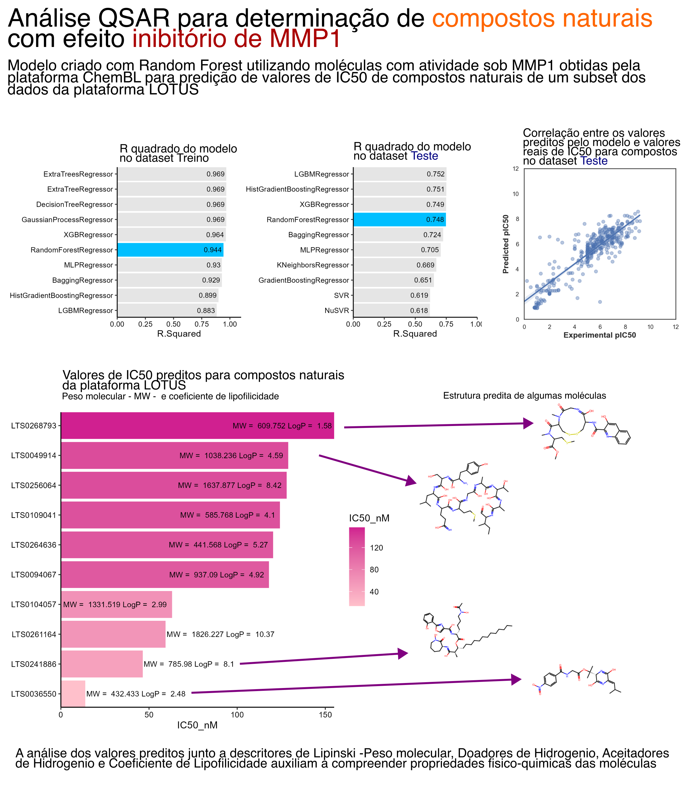

# teste_qsar

Teste de ferramentas de analises QSAR para predição de propriedades de possíveis compostos cosméticos  
Neste teste, foi realizado um modelo de treinamento de moléculas que interagem com MMP1 (metaloproteinase-1) para predição de IC50 de compostos naturais obtidos na base de dados LOTUS  
  
A análise QSAR foi feita utilizando python, biblitecas rdkit, padeldescriptors e sqlearn para determinação de descritores químicos e machine learning (Random forest)  

Foi utilizado R para criação de gráficos
   

